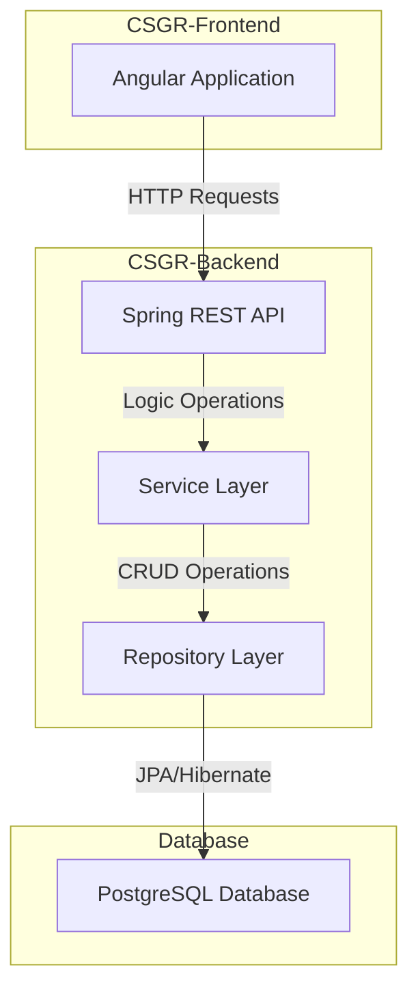

# CSGR - Case Study Groupchat Roulette

## Overview

This project uses a standard 3-tier architecture for a web application:

## Software requirements for complete local usage and development

- mermaid IntelliJ Plugin (https://plugins.jetbrains.com/plugin/20146-mermaid)
- git (https://git-scm.com/downloads)
- docker (https://docs.docker.com/get-started/get-docker/)
- docker-compose (installed with Docker Desktop) (https://docs.docker.com/compose/install/)
- node (https://nodejs.org/en/download)
- angular-cli (https://angular.dev/tools/cli/setup-local)

### Helpful tools

- API-Testing tools (eg. Postman / Insomnia)
- DBMS (eg. DBeaver / pgAdmin)

## System components

Here you can find a brief overview of the system components. For further details click on the headers or visit the related README files in the respective folders.

### [CSGR-Infrastructure](csgr-infrastructure/README.md)

In the infrastructure folder you find the docker-compose file for the initial setup of the postgresql database docker container.

### [CSGR-Backend](csgr-backend/README.md)

The backend is based on Spring Boot. It's providing API access to the year plan generation logic and different export options.

### [CSGR-Frontend](csgr-frontend/README.md)

This contains a simple angular frontend for api usage and use interaction with the year plans.

## Links to related docs

* [infrastructure-docs](csgr-infrastructure/README.md)
* [backend-docs](csgr-backend/README.md)
* [frontend-docs](csgr-frontend/README.md)

# Architecture design decision

The general 3-tier system architecture was chosen because of its simplicity for the given requirements.
Providing this as a web application has the benefits of simple hosting and networking for access from multiple people in different teams, locally and remotely.

# Non-functional requirements

## Security

Because we have personal data saved in the year plans we have to be careful when handling this data. The following things should be kept in mind.
- No free access to personal data. Authentication is mandatory! (currently not implemented)
- Keep it to a minimum! Only save as much personal data as necessary.

## Performance

Generating Excel and iCalendar files is costly and because the year plans are not supposed to be changed we should
generate them once when the year plan is initially saved. If changes were enabled later we should generate the file once
when the file is downloaded the first time, so that we don't generate unnecessary revisions.

Consider generating year plans (and resulting export files) asynchronously to make the API more snappy (depends on workload).

The current backend implementation contains the classic N+1 problem. This could be alleviated with different API design. For example
DGS uses data loaders for solving this with a GraphQL API in Spring (https://netflix.github.io/dgs/data-loaders/).

## Reliability

With containerization and docker/kubernetes we can run multiple instances to ensure the service is (almost) always available.
Logging and monitoring are also necessary for inspecting potential and real problems within the application.

## Scalability

In combination with the reliability concerns we have to ensure to keep services as stateless as possible to enable scalability.

## Resiliency

Proper input validation, error handling and API responses for the frontend enable the backend to be more resilient regarding invalid API inputs.

# Things I'd do differently, if this was some different system going into production

1) Put the DB password in a secret instead of cleartext within the docker-compose file
2) Use ENVs for configuration of the different software components
3) Secure the application (authentication and authorization)
4) Move api-file generation to pre-commit Hook or CI-Pipeline instead of manual execution
5) Consider using a Java mapping library (eg. MapStruct)