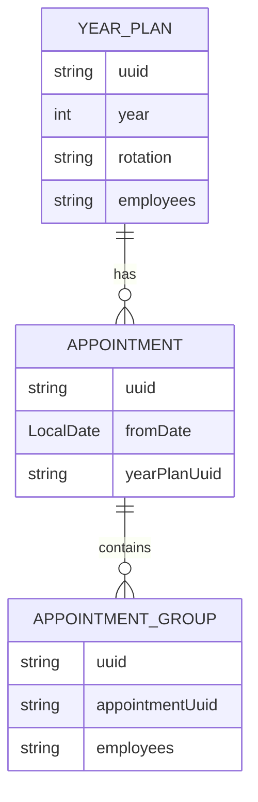
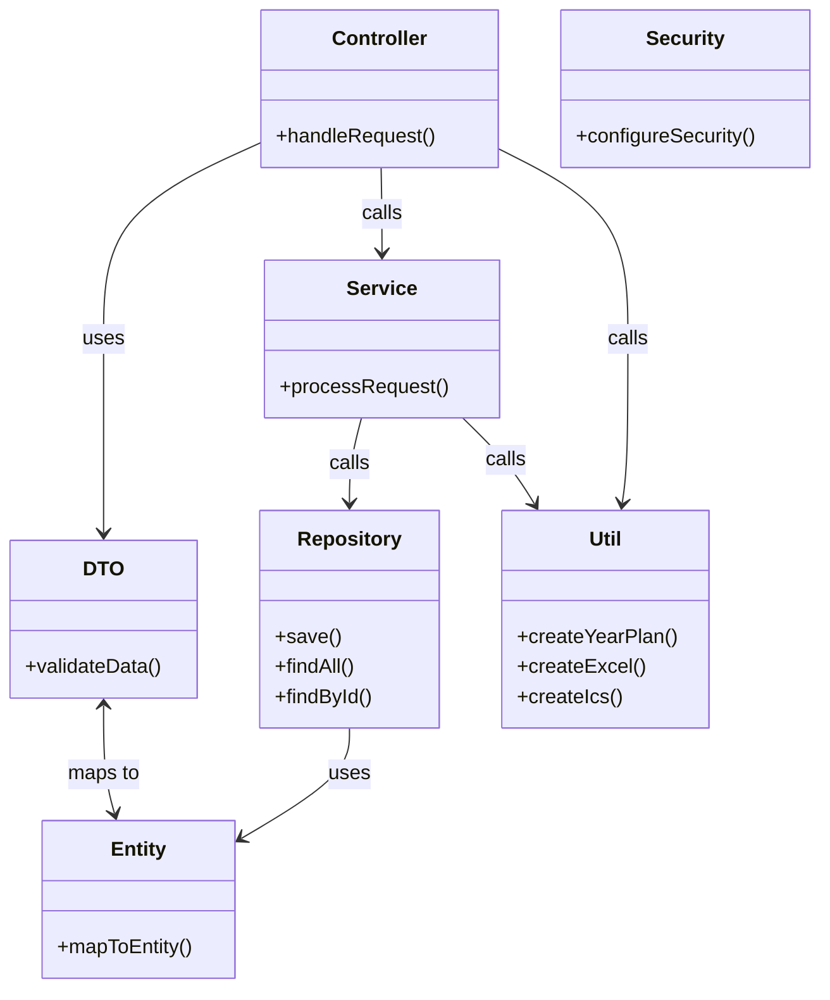

# CSGR-Backend
## Technical Requirements

- Java 21

## Setup

- setup postgreSQL database (see [infrastructure-docs](../csgr-infrastructure/README.md) for instructions)
- Sync the gradle project to automatically download the libraries

## Running the application

Either run the [CsgrApplication](src/main/java/de/csgr/CsgrApplication.java) through IntelliJ or use the `bootRun` gradle task.
Make sure you are in the correct folder when running this manually (csgr-backend):

```bash
./gradlew bootrun
```

## [api](api/)

Contains the openAPI file with the current API definition for quick usage and reference.

## ER-Model

Current ER-Model for this service:



## [src/main/java](src/main/java/de/csgr/)
The following packages dictate the general structure of the backend application:
- [configuration](src/main/java/de/csgr/configuration/)
    - contains general application configurations (eg. security config)
- [controller](src/main/java/de/csgr/controller/)
    - API entrypoints
- [dto](src/main/java/de/csgr/dto/)
    - objects for use in the API endpoints
- [entity](src/main/java/de/csgr/entity/)
    - objects for use with the ORM (DB representation)
- [repository](src/main/java/de/csgr/repository/)
    - handling of database requests through spring repository interfaces
- [service](src/main/java/de/csgr/service/)
    - further processes controller requests and encapsulates business logic
- [util](src/main/java/de/csgr/util/)
    - static utility methods for generating year plans and exporting to excel + iCal


Here is a overview how those packages interact with each other:



## [src/main/resources](src/main/resources/)
- [application.yaml](src/main/resources/application.yaml)
    - contains the application configuration properties
- [db.migration](src/main/resources/db/migration/)
    - contains the Flyway database migration files. Do not change already deployed database migration files!

## Detailed documentation

Detailed documentation of how specific complex components work:

- [util](docs/util.md) (eg. year plan generation)


## Why Java 21?

Until Java 25 is released in September 2025 version 21 is the latest LTS version. Using version 21 ensures, that
the Java version is at least supported until September 2028. This enables developers to focus on providing and improving
functionality instead of frequently upgrading old software versions out of necessity.

## Used libraries

- Flyway (DB versioning and migration tool) (https://www.red-gate.com/products/flyway/community/)
  - Hibernate Auto-DDL is implicit and often leads to more errors because DB-Design wasn't thought through
  - Easy integration into spring, currently no rollback migrations are necessary, why Flyway instead of Liquibase was used
- Lombok (https://projectlombok.org/)
  - Removes unnecessary boilerplate code from the project (getters, setters, some constructors)
- Springdoc OpenAPI (https://springdoc.org/)
  - Generates the OpenAPI definition of the REST API
  - Solves writing APIs from hand when going for an API-first approach
  - Enables quickly getting the API up to speed to parallelize frontend and backend development
- iCal4j (iCalendar implementation for Java) (https://www.ical4j.org/)
  - makes generating .ics files easy
  - frequently maintained and updated
- Apache POI (https://poi.apache.org/components/)
  - wide support for different Microsoft Office formats, not just Excel
  - frequently maintained and updated
  - widely adopted

## Generating API doc file

Use the following gradle task to generate the openapi.yaml file for local development use.
Make sure the application is running before executing the command.

```bash
./gradlew generateOpenApiYaml
```
