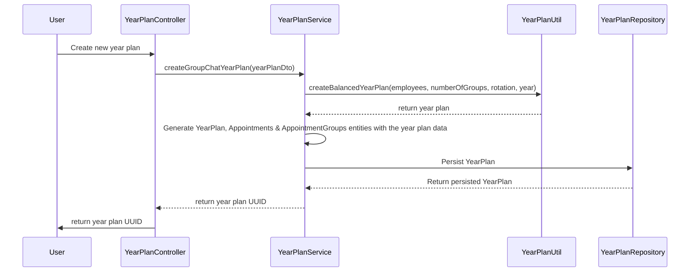
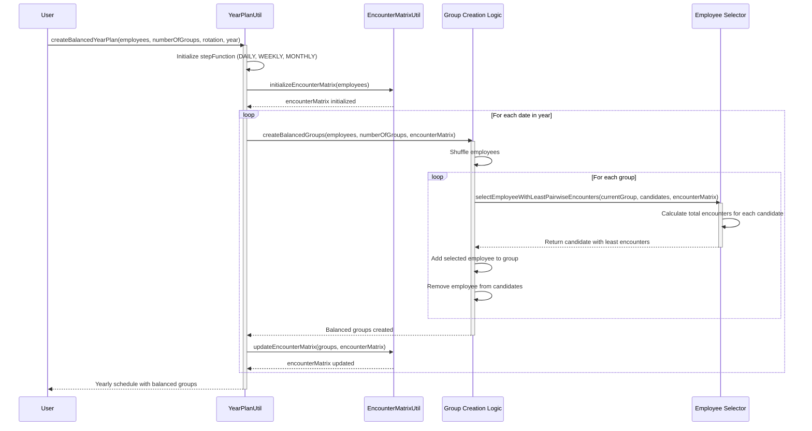

# Util-Docs

More detailed documentation of how util components work.

## YearPlanUtil

### High level overview

High level overview of how a new year plan is created:

### Detailed look into the logic

A more detailed look into the year plan generation logic:

